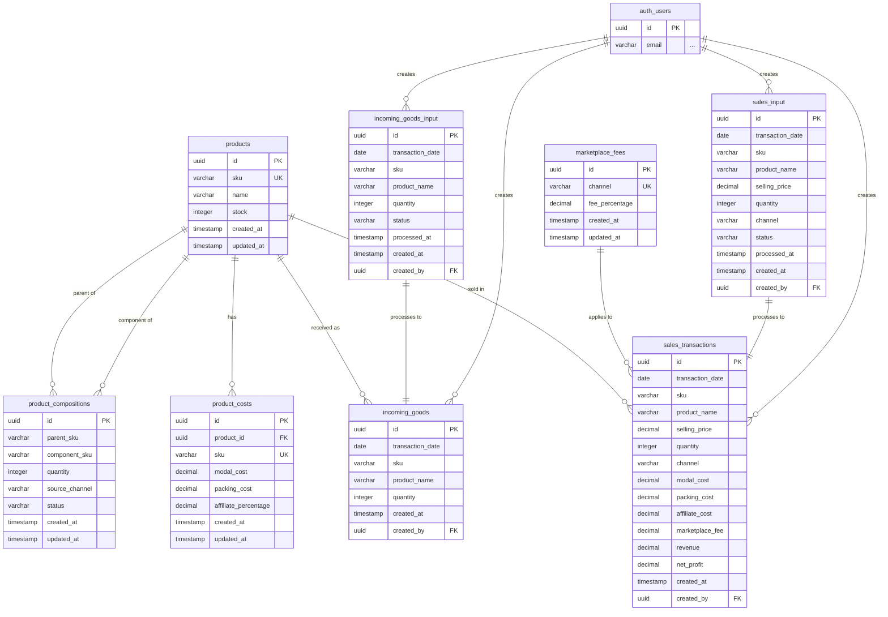

# TokoFlow ERD (Entity Relationship Diagram)

## Key Relationships:

1. **Products** are the core entity with relationships to:
   - Product costs (1:1)
   - Sales transactions (1:many)
   - Incoming goods records (1:many)
   - Product compositions as both parent and component (many:many)

2. **Input Tables** (sales_input, incoming_goods_input):
   - Temporary staging tables that get processed
   - Records move to transaction tables after processing
   - Quantity field is cleared after processing (like the original spreadsheet)

3. **Marketplace Fees**:
   - Applied to sales transactions based on channel

4. **Product Compositions**:
   - Define bundle/package relationships
   - Can be channel-specific or apply to all channels ("semua")

5. **User Tracking**:
   - All transactions track who created them via created_by field
   - Links to Supabase auth.users table
